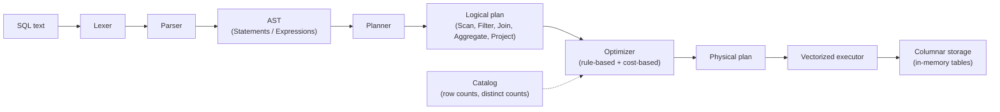

# QuillDB

A SQL query engine built from scratch in C++ — lexer, parser, logical planner, and a vectorized (columnar) executor. QuillDB exists to answer one question honestly: *what actually happens between typing a `SELECT` and getting rows back?*

No external SQL/parsing libraries, no bundled storage engine — every stage of the pipeline is hand-written.

## Architecture



Each stage is a distinct module under `src/`, mirroring how production query engines (Postgres, DuckDB) separate concerns:

| Stage | Directory | Responsibility |
|---|---|---|
| Lexer | `src/lexer` | Tokenizes raw SQL text into a token stream |
| Parser | `src/parser` | Recursive-descent parser → builds the AST |
| AST | `src/ast` | Statement/Expression node definitions (`SelectStatement`, `BinaryExpression`, `FunctionCall`, ...) |
| Planner | `src/planner` | Converts the AST into a tree of relational algebra operators (the logical plan) |
| Executor | `src/executor` | Walks the plan and executes it using the Volcano/iterator model over columnar `Chunk`s |
| Storage | `src/storage` | In-memory columnar `Table` / `Index` representation |
| Optimizer | `src/optimizer` | Rule-based + cost-based rewrites of the logical plan |
| Catalog | `src/catalog` | Row counts and index metadata used by the optimizer |
| CLI | `src/cli` | Entry point that wires the pipeline together, plus a standalone benchmark runner |

## Current status

**Phase 1, 2 & 3 are implemented.** The optimizer performs predicate pushdown, automatic index selection (rewriting `Filter + SeqScan` into `IndexScan` when the catalog reports an index), and cost-based `NestedLoopJoin` vs. `HashJoin` selection. `EXPLAIN <query>` prints the plan before and after optimization.

### Supported SQL

```sql
SELECT col1, col2, SUM(col3)
FROM table_a
JOIN table_b ON table_a.id = table_b.a_id
WHERE col1 = 42
GROUP BY col1, col2;
```

- `SELECT` with column projection and aggregate functions (`SUM`, `COUNT`, ...)
- `FROM` with a single base table
- `JOIN ... ON <predicate>` (executed as a nested-loop join)
- `WHERE` with comparison operators (`=`, `>`, `<`, ...)
- `GROUP BY` with multiple grouping columns

- `EXPLAIN <query>` — prints the logical plan before and after optimization

Not yet supported: `INSERT`/`CREATE TABLE` via SQL (tables and indexes are currently built programmatically via the `Table`/`Catalog` API — see below), `ORDER BY`, `LIMIT`, subqueries, multi-way joins beyond a chain, `OR`/`AND` predicate composition.

### Execution model

Data is stored **columnar** (`Table::column_data_`, one vector per column) and executed **vectorized** — operators pull `Chunk`s (batches of rows, column-major) from their children rather than one row at a time, following the Volcano/iterator (`init()` / `next()`) execution model used by most real query engines.

## Build & run

Requires CMake 3.14+ and a C++17 compiler.

```powershell
# From the project root
mkdir build
cd build
cmake ..
cmake --build .

# Run
.\quilldb.exe          # Windows
./quilldb               # Linux / macOS
```

> The current `main.cpp` runs a fixed demo query (`EXPLAIN SELECT name FROM users WHERE id = 42;`) against a hardcoded in-memory table and prints the plan before and after optimization, so the index-selection rewrite is observable end-to-end without a REPL.

## Benchmarks

`src/cli/benchmark.cpp` builds a second executable, `quilldb_benchmark`, that isolates the payoff of the optimizer's automatic index selection: it runs `SELECT name FROM users WHERE id = <val>;` twice against the same table — once forcing a `Filter -> SeqScan` (what the naive Phase 1/2 planner would have produced) and once via the optimizer-selected `IndexScan` (a single `unordered_map` lookup in `Index`, see `src/storage/Index.h`) — and times both with `std::chrono::high_resolution_clock`.

```
cmake --build . --target quilldb_benchmark
./quilldb_benchmark        # Linux / macOS
.\quilldb_benchmark.exe    # Windows
```

The checked-in benchmark defaults to 1,000,000,000 rows, which needs more RAM than a typical dev machine has free just for two `std::string` columns held in memory. The results below were captured by building the same code with the row count turned down to 20,000,000 (`sed -i 's/1000000000/20000000/'`) on a single-core Linux sandbox (g++ -O2):

| Scan type | Plan | Time (20M rows) | 
|---|---|---|
| Sequential scan | `Filter -> SeqScan` | ~410–450 ms |
| Index scan | `IndexScan` (`Index::lookup`) | ~2–3 µs |

That's roughly **140,000×–225,000× faster** for a single-row point lookup — the expected shape for O(N) vs. O(1) once N is large, though the exact multiplier is noisy at microsecond scale and will vary by machine. The relationship that matters: sequential scan time grows linearly with table size, while the hash-index lookup stays flat regardless of N, which is exactly what the optimizer is exploiting when it rewrites `Filter + SeqScan` into `IndexScan`.

*(Numbers above are from one local run for illustration — re-run `quilldb_benchmark` yourself for hardware-accurate results, and set `dim` back to 1,000,000,000 if your machine has the RAM for it.)*

## Roadmap

### Phase 1 — Front end ✅
- [x] Lexer: SQL text → tokens
- [x] Recursive-descent parser: tokens → AST
- [x] Logical planner: AST → relational algebra tree (`SeqScan`, `Filter`, `Project`)

### Phase 2 — Execution ✅
- [x] Columnar storage (`Table`, `Chunk`)
- [x] Vectorized (Volcano-model) executor
- [x] `JOIN ... ON` via nested-loop join
- [x] `GROUP BY` + aggregate functions (`AggregateNode`)

### Phase 3 — Optimizer ✅
- [x] **Rule-based optimization**: predicate pushdown, plus automatic index selection (rewrites `Filter + SeqScan` into `IndexScan` when the catalog reports a matching index)
- [x] **Catalog statistics**: track row counts and registered indexes per table (`Catalog`)
- [x] **Cost-based join selection**: `HashJoinNode` alongside the existing `NestedLoopJoinNode`; the optimizer picks between them at optimization time
- [x] **`EXPLAIN`**: `EXPLAIN <query>` plans + optimizes without executing, printing the plan tree via `PlanNode::toString()` before and after optimization

## Project structure

```
quilldb/
├── CMakeLists.txt
├── src/
│   ├── lexer/       # Lexer.h / Lexer.cpp / TokenType.h
│   ├── parser/       # Parser.h / Parser.cpp
│   ├── ast/          # AST.h — Statement & Expression node definitions
│   ├── planner/       # Planner.h / Planner.cpp, LogicalPlan.h — operator tree
│   ├── optimizer/     # Optimizer.h / Optimizer.cpp — predicate pushdown, index selection, cost-based join choice
│   ├── catalog/       # Catalog.h / Catalog.cpp — row counts + index metadata
│   ├── executor/      # Executor.h / Executor.cpp — Volcano-model execution
│   ├── storage/       # Storage.h, Index.h — columnar Table / Chunk / hash Index
│   └── cli/          # main.cpp — entry point; benchmark.cpp — perf benchmark runner
└── build/            # CMake build output (generated)
```