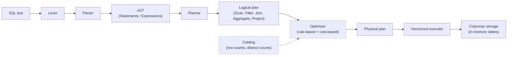

# QuillDB

A SQL query engine built from scratch in C++ — lexer, parser, logical planner, and a vectorized (columnar) executor. QuillDB exists to answer one question honestly: *what actually happens between typing a `SELECT` and getting rows back?*

No external SQL/parsing libraries, no bundled storage engine — every stage of the pipeline is hand-written.

## Architecture



*(Dashed boxes are Phase 3 — see [Roadmap](#roadmap).)*

Each stage is a distinct module under `src/`, mirroring how production query engines (Postgres, DuckDB) separate concerns:

| Stage | Directory | Responsibility |
|---|---|---|
| Lexer | `src/lexer` | Tokenizes raw SQL text into a token stream |
| Parser | `src/parser` | Recursive-descent parser → builds the AST |
| AST | `src/ast` | Statement/Expression node definitions (`SelectStatement`, `BinaryExpression`, `FunctionCall`, ...) |
| Planner | `src/planner` | Converts the AST into a tree of relational algebra operators (the logical plan) |
| Executor | `src/executor` | Walks the plan and executes it using the Volcano/iterator model over columnar `Chunk`s |
| Storage | `src/storage` | In-memory columnar `Table` representation |
| CLI | `src/cli` | Entry point that wires the pipeline together |

## Current status

**Phase 1 & 2 are implemented.** Phase 3 (optimizer) is in progress — see the [Roadmap](#roadmap) below for exact scope.

### Supported SQL

```sql
SELECT col1, col2, SUM(col3)
FROM table_a
JOIN table_b ON table_a.id = table_b.a_id
WHERE col1 = 42
GROUP BY col1, col2;
```

- `SELECT` with column projection and aggregate functions (`SUM`, `COUNT`, ...)
- `FROM` with a single base table
- `JOIN ... ON <predicate>` (executed as a nested-loop join)
- `WHERE` with comparison operators (`=`, `>`, `<`, ...)
- `GROUP BY` with multiple grouping columns

Not yet supported: `INSERT`/`CREATE TABLE` via SQL (tables are currently built programmatically via the `Table` API — see below), `ORDER BY`, `LIMIT`, subqueries, multi-way joins beyond a chain, `OR`/`AND` predicate composition.

### Execution model

Data is stored **columnar** (`Table::column_data_`, one vector per column) and executed **vectorized** — operators pull `Chunk`s (batches of rows, column-major) from their children rather than one row at a time, following the Volcano/iterator (`init()` / `next()`) execution model used by most real query engines.

## Build & run

Requires CMake 3.14+ and a C++17 compiler.

```powershell
# From the project root
mkdir build
cd build
cmake ..
cmake --build .

# Run
.\quilldb.exe          # Windows
./quilldb               # Linux / macOS
```

> The current `main.cpp` runs a fixed demo query (`SELECT user_id, SUM(amount) FROM orders GROUP BY user_id;`) against a hardcoded in-memory table, to keep the pipeline observable end-to-end while the engine is under active development. An interactive REPL / file-based query input is on the Phase 3+ roadmap.

## Roadmap

### Phase 1 — Front end ✅
- [x] Lexer: SQL text → tokens
- [x] Recursive-descent parser: tokens → AST
- [x] Logical planner: AST → relational algebra tree (`SeqScan`, `Filter`, `Project`)

### Phase 2 — Execution ✅
- [x] Columnar storage (`Table`, `Chunk`)
- [x] Vectorized (Volcano-model) executor
- [x] `JOIN ... ON` via nested-loop join
- [x] `GROUP BY` + aggregate functions (`AggregateNode`)

### Phase 3 — Optimizer (in progress)
- [ ] **Rule-based optimization**: predicate pushdown (move `Filter` below `Join`/`Project` when the predicate only touches one side) and projection pushdown (propagate the minimal required column set down to `SeqScan`)
- [ ] **Catalog statistics**: track row counts and per-column distinct counts per table, refreshed on load/insert
- [ ] **Cost-based join selection**: add a `HashJoinNode` alongside the existing `NestedLoopJoinNode`; use catalog stats to estimate cost for each and pick the cheaper physical plan at optimization time
- [ ] **`EXPLAIN`**: extend the existing `PlanNode::toString()` machinery to also print estimated row counts / cost per node, and add an `EXPLAIN <query>` entry point that plans + optimizes without executing

### Beyond Phase 3
- [ ] `INSERT`/`CREATE TABLE` via SQL
- [ ] `ORDER BY`, `LIMIT`
- [ ] Typed columns (currently all values are stored as strings)
- [ ] Interactive REPL
- [ ] Persistence (currently fully in-memory)

## Project structure

```
quilldb/
├── CMakeLists.txt
├── src/
│   ├── lexer/       # Lexer.h / Lexer.cpp / TokenType.h
│   ├── parser/       # Parser.h / Parser.cpp
│   ├── ast/          # AST.h — Statement & Expression node definitions
│   ├── planner/       # Planner.h / Planner.cpp, LogicalPlan.h — operator tree
│   ├── executor/      # Executor.h / Executor.cpp — Volcano-model execution
│   ├── storage/       # Storage.h — columnar Table / Chunk
│   └── cli/          # main.cpp — entry point
└── build/            # CMake build output (generated)
```

## Why this project exists

Most course projects stop at "parse SQL and run it." QuillDB is built to go one layer deeper — into the part of a database that decides *how* a query should run, not just *what* it means: predicate/projection pushdown, cost-based physical plan selection, and `EXPLAIN`. That's the layer where systems like Postgres, DuckDB, and Spark SQL actually earn their performance.

## License
